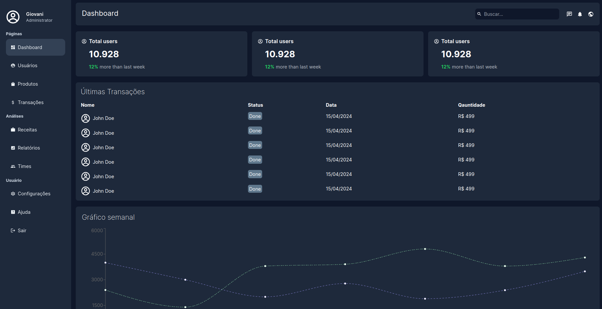
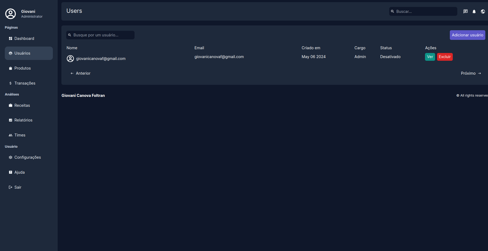
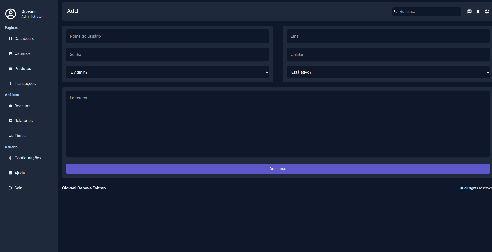
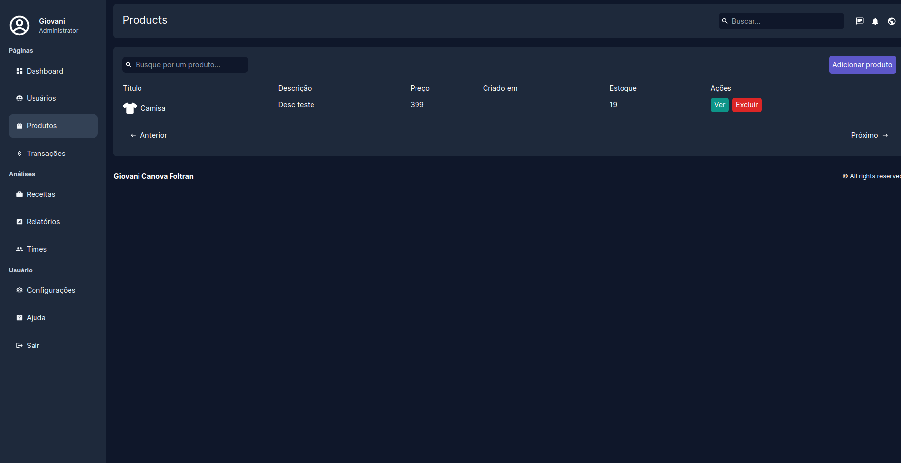

# - Fullstack E-Commerce Marketplace.

Desenvolvido com Next.js 14 App Router, tRPC, TypeScript, Payload & Tailwind

## Features

- 🛠️ Dashboard completo construído com Next.js 14
- 🛠️ Utilizando MongoDB.
- 💻 CRUD de produtos e usuários com paginação.
- 💻 Sistema de busca em tempo real.
- 💻 Açoes do servidor.
- 🔑 Autenticação
- 🌟 Tailwind para estilização.

## Apresentação
### Dashboard principal


### Página de listagem de usuários


### Página de cadastro de usuários


### Página de produtos



## Como rodar
```bash
git clone 

npm install

npm run dev
